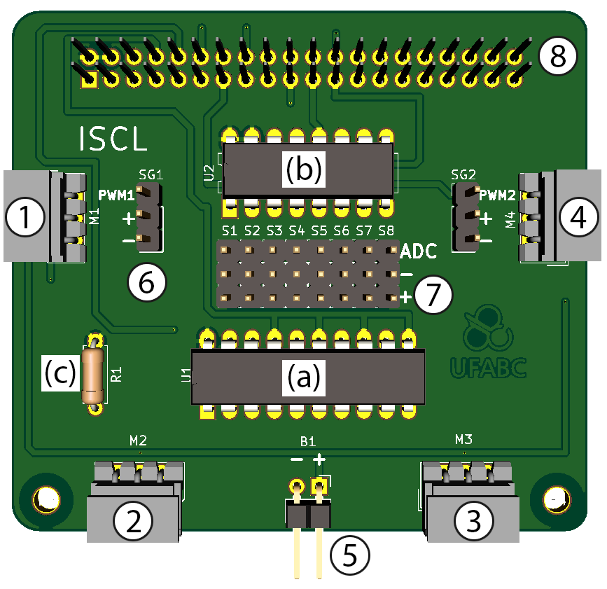

# Communication between AX-12A, Java and Raspberry Pi 3B

**Description:** Java library, developed with Pi4J [1], to control AX-12A servos with Raspberry Pi 3B.

## 1.Electronic Project
You can purchase the Raspi2Dynamixel V2 _shield_ from gilmarjeronimo@uol.com.br: 

Or, the following circuit can be assembled, adapted from [2]. In (a) is illustrated the Raspberry Pi 3B, in (b) the CI 74LS241, in (c) the AX-12A motor servos and in (d) the LiPo 11.1V, 1000mAh battery.   

## 2.Installation

Some packages are required to use the library, such as Pi4J. The use of IDEs such as Eclipse [3], Netbeans [4] and BlueJ [5] is optional, but is highly recommended for code correction. The last operating system update presented some problems for installation and preparation of the IDEs, so it will be suggested the use of Geany to compile the code by the command terminal. The following are the procedures for installing the Pi4J library on Raspberry Pi. 

### 2.1.Preparing Raspberry with Noobs Version 3.3.1 (2020-02-14)

*By Turning on Raspberry Pi:*

	1. In the terminal type: 
		1. sudo apt-get update
		2. sudo apt-get upgrade
		3. sudo apt-get install leafpad
		4. sudo leafpad /boot/config.txt
			
	2. It will open the file, at the end of it add:
		1. enable_uart=1
		2. dtparam=uart0=on
		3. dtoverlay=pi3-miniuart-bt
			
	3. In the terminal type: 
		1. sudo leafpad ~/.bashrc
			
	4. At the end of the file place: 
		1. sudo chmod -R 777 /dev/ttyAMA0
		2. sudo chmod -R 777 /root
		3. sudo chmod -R 777 '/dev/ttyAMA0
		4. sudo chmod -R 777 '/root
			
	5. Remove the contents of the cmdline.txt file
		1. sudo leafpad /boot/cmdline.txt
		2. remove "console=serial0, 115200"
		
	6. In the terminal:
		1. sudo raspi-config
		2. Select "Interfacing Options -> Serial".
		3. Put "No" and "Yes" respectively

	7. Will ask to reboot, put "Yes"
				
	8. If you don't ask, in the terminal type: 
		1. sudo reboot

**obs:** Any problem with serial communication, view the video of [6].

### 2.2.PI4J 

*Preparing Java:*

	Install Java and Verify Your Version:
		1. sudo apt update
		2. sudo apt install default-jdk
		3. java -version

The output will be something like

	openjdk version "11.0.6" 2020-01-14
	OpenJDK Runtime Environment (build 11.0.6+10-post-Raspbian-1deb10u1)
	OpenJDK Server VM (build 11.0.6+10-post-Raspbian-1deb10u1, mixed mode)

More questions can be answered in [7].

*Preparing the WiringPi *

Usually the WiringPi library is already installed in the new versions, so the steps to follow are guarantees.

	1. In the terminal:
		1. Sudo apt-get install wiringpi

To test, type in the terminal

	1. gpio readall 

This will show all available RPi3 ports and how they are configured to be used.

More questions, see [8].

*Preparing Pi4J:*

	1. In the terminal: 
		1. curl -sSL https://pi4j.com/install | sudo bash
		2. sudo apt-get install pi4j

After that, the files of pi4j, including the .jar will be in the folder: /opt/pi4j 

## 2.AX12-JavA Programs and Functions 

Inside the ServosAX/src folder, you will find the following files:

*Class* |*Function*
------------- | -------------
*AX12.java:* | Class that implements Dynamixel AX class servos functions.                              
*Bioloid.java:* | Class to assist in Bioloid functions, such as zeroing engines and putting them in the initial position.
*panTilt.java:* | Implements the functions to run with SG90 servos.
*Run.java:* | Allows to run the main of the program.

### 2.1.Functions

AX12.java

*Method * | *Function *
------------- | -------------
_serial()_ | Initializes the serial communication of the motors, always start with this function.
_direction(int)_ | Sets GPIO pin 8 to change state, HIGH if int = 1 or LOW if int = 0.  
_move(id, pos)_ | Moves the servo from a certain ID to a position between 0 (0°) and 1024 (300°).
_moveSpeed(id, pos, speed)_ | Moves the servo from a certain ID to a position between 0 (0°) and 1024 (300°) with speed between 0 and 1024.
_ping(id)_ | Returns what is the _ping_ of the motor indicated by the ID.
_factoryReset(id)_ | Performs the Factory Reset on the engine with the ID indicated.This setting will lose connection to the PI4J, since the factory baudrate is 1000000.
This setting will lose connection to the PI4J, since the factory baudrate is 1000000, not supported by the library.
_setID(id, newID)_ | Change the indicated motor ID (id) to a new one (newID) of 0-252.
_setBaudRate(id,baudrate)_ | Change the Baud Rate of the chosen engine from 2000000-8000 bps.
_setStatusReturnLevel(id,level)_ | Decides how to return a Status Package, if level = 0 no read will be returned except ping, if level = 1 returns a message for the read command only, and if level = 2 returns a message for all sent commands. 
_setReturnDelayTime(id,delay)_ | This is the time delay between the message transmitted from the Instruction packet and received in the Status packet. It varies from 0 to 254, with 1 delay of 2 microseconds, 2 a delay of 4 microseconds, and 250 a delay of 0.5 milliseconds. 
_lockRegister(id)_ | Lock EEPROM area of the servo, cannot be modified. It prevents changing ID, Baud Rate, Torque and others. 
_moveRW(id, position)_ | Sets the servo to move in continuous rotation.
_moveSpeedRW(id,position,speed)_ | Sets the speed of the servo for continuous rotation.
_action()_ | Check if there is any command transmitted to REG_WRITE
_setTorqueStatus(id,status)_ | Defines whether the engine torque is on or off. If status = 0 maintains torque, if status = 1 generates torque.
_setLedStatus(id,status)_ | Sets the status of the engine LED. If status = 0 the LED turns off, if status = 1 the LED turns on.
_setTemperatureLimit(id,temp)_ | Sets the servo limit temperature, going from 0 to 99°C.
_setVoltageLimit(id,lowVolt,highVolt)_ | Sets the voltage limit of the servo, going from 50 to 250 for lowVolt and highVolt. If the value is 50, we have 5V.
_setAngleLimit(id,cwLimit,ccwLimit)_ | Sets the limit angle in clockwise (clockwise) and counterclockwise (counterclockwise) direction. Going from 0 to 1023.
_setTorqueLimit(id,torque)_ | Sets the limit torque, going from 0 to 1023.
_setPunchLimit(id,punch)_ | Sets the current to drive the engine, going from 0 to 1023.
_setCompliance(id,cwMargin, ccwMargin, cwSlope, ccwSlope)_ | Sets the motor control flexibility. cwMargin and ccwMargin range from 1 to 254 and represent the error between the desired position and the current position. While cwSlope and ccwSlope are fixed values of [2,4,8,16,32,64,128], which define the Torque level near the desired position.
_setLedAlarm(id,alarm)_ | Sets the LED alarm. Its value can be [1,2,4,8,16,32,64]. The value 1 represents an error in the input voltage, 2 an error in the limit angle, 4 overheat problem, 8 range problem, 16 checksum problem, 32 overload problem and 64 instruction problem. 
_setShutdownAlarm(id,alarm)_ | Set the alarm. Its value can be [1,2,4,8,16,32,64]. Value 1 represents an error in input voltage, 2 an error in threshold angle, 4 overheat problem, 8 range problem, 16 checksum problem, 32 overload problem, and 64 instruction problem. 
_readTemperature(id)_ | Reads the temperature of the servo. (Not FINISHED).
_readPosition(id)_ | Reads Current Servo Position.(Not ENDED).
_readVoltage(id)_ | Reads Servo Voltage. (Not ENDED).
_readSpeed(id)_ | Reads Servo Speed. (Not FINISHED).
_readLoad(id)_ | Reads the servo load. (Not ENDED).
_readMovingStatus(id)_ | Reads if the servo is moving or not. (Not ENDED).
_readRWStatus(id)_ | Reads if servo is in continuous rotation. (Not ENDED).

More information in [9].

Bioloid.java

*Method * |*Function *
------------- | -------------
_initialPos()_ | Arrow the engines in starting position.                                                                                                                                                                                                                                                                 
_clear()_ | Set engines to 512.

### 2.2.How to run

	1. enter the terminal in the ServosAX folder
		1. sudo javac -d bin/ -cp "lib/pi4j/*:.jar" src/*.java
		2. sudo java -cp "lib/pi4j/*:.jar:bin" Run
		

**Possible Problems**
	
_1) Code does not rotate_
	
	The Java file runs at a specific Baud Rate, in addition, other serial and GPIO ports can be used, just perform the above configuration to set other ports. In the Ax12.java file there is a line written:
	
		- public static GpioPinDigitalOutput RPI_DIRECTION_PIN = gpio.provisionDigitalOutputPin(RaspiPin.GPIO_08); //PORTS RELATED PI4J
		- static int port = Serial.serialOpen(Serial.DEFAULT_COM_PORT, 1000000);
	
	If you want to test your Raspberry's Serial communication and check that it is working, use an Arduino and assemble the following circuit. Use the Arduino code at https://github.com/LAB08-SBC/BioloidCodes/blob/master/SerialArduinoRasp.ino. Access the Arduino Serial terminal and change the Baud Rate to the same one from Raspberry. 
	
	Run the program in arduino, then the Raspberry python. Check if the characters are transmitted to Arduino's Serial terminal, if so, the Serial communication is working (TIP: testing with different Baud Rates).
	
_2) Serial communication works, but the engine does not move_
	
	Check that the baudrate of the AX-12A engines are the same as those you are using in java code.
	
	Use RoboPlus together with DynamixelWizard. Use the factory standards, with baudrate = 1000000 and check if the engine ID is correct.
	
	Perform step 1 again.	
	
## 4.Support

  

## 5.References 

[1] PI4J©. **The Pi4J Project: Java I/O Library for the Raspberry Pi**. Available at: <http://pi4j.com/download.html>. Access on October 4, 2017: Pi4J©, 2016.

[2] HERSAN, T. **How to Drive Dynamixel AX-12A Servos (with a RaspberryPi)**. Available at: <http://www.instructables.com/id/How-to-drive-Dynamixel-AX-12A-servos-with-a-Raspbe/>. Accessed October 3, 2017: Instructables, 2015.

[3] ECLIPSE, I.; IDE, E. __Documentation of. Eclipse©__. Available at:<http://www.eclipse.org>. Access on October 4, 2017, v. 12, 2006.

[4] NETBEANS, I. __Netbeans©__. Available at:<http://netbeans.org/>. Access on October 4, 2017, v. 11, 2008.

[5] KÖLLING, M. et al. __The bluej system and its pedagogy__. Computer Science Education, Taylor & Francis, v. 13, n. 4, p. 249-268, 2003.

[6] AL, S. "Raspberry PI3 PI4 Solution to UART PermissionDenied". Available at <https://www.youtube.com/watch?v=StFZj7gSwNs>. Access on 06 April 2020. YouTube, 2020.

[7] LINUXIZE. **How to Install Java on Raspberry Pi**. Available at: https://linuxize.com/post/install-java-on-raspberry-pi/. Access on 06 April 2020: Linuxize, 2020.

[8] WIRINGPI. **Download and Install**. Available at: http://wiringpi.com/download-and-install/. Access on April 06, 2020. WiringPi, 2020.

[9] ROBOTIS.__AX-12/ AX-12+/ AX-12A__. Available at: <http://support.robotis.com/en/product/actuator/dynamixel/ax_series/dxl_ax_actuator.htm#Actuator_Address_2F>. Access on May 26, 2018.

JERONIMO, G. C. **Implementation of Image Processing Technique for RoboCup Kid Size Category with Real Validation on Bioloid ROBOTIS Premium Platform**. FAPESP, UFABC, 2016.

HERSAN, T. **AX-12 Python Library (for RaspberryPi)**. [S.l.]: GitHub, 2014. <https://github.com/thiagohersan/memememe/tree/master/Python/ax12>.

PI4J©. **Pi4J :: Parent POM 1.1 API**. Available at: <http://pi4j.com/apidocs/>. Access on October 13, 2017: Pi4J©, 2016.

CROSTON, B. __RPi.GPIO module basics__. Available at: <https://sourceforge.net/p/raspberry-gpio-python/wiki/BasicUsage/>. Access on October 13, 2017.

PI4J©. **Simple GPIO Control using Pi4J**. Available at: <http://pi4j.com/example/control.html>. Access on October 13, 2017: Pi4J©, 2016.

Programiz©. **Python chr()**. Available at: <https://www.programiz.com/python-programming/methods/built-in/chr>. Access on October 13, 2017.

LIECHTI, C. ©. **pySerial API**. Available at: <http://pyserial.readthedocs.io/en/latest/pyserial_api.html>. Access on October 13, 2017.

EICKHOLD, J. **Serial Communication in Java with Raspberry Pi and RXTX**. Available at: <https://eclipsesource.com/blogs/2012/10/17/serial-communication-in-java-with-raspberry-pi-and-rxtx/>. Access on October 13, 2017.

Python. **FAQ: What do the operators <<, >>, &, |, ~, and ^ do?**. Available at: <https://wiki.python.org/moin/BitwiseOperators>. Access on October 13, 2017.

TutorialsPoint. **Java - Bitwise Operators Example**. Available at: <https://www.tutorialspoint.com/java/java_bitwise_operators_examples.htm>. Access on October 13, 2017.

Domoticz. **Domoticz error after RPI update**. Available at: <https://www.domoticz.com/forum/viewtopic.php?t=16433#p122279>. Access on October 13, 2017.

Opeedijk. **Dynamixel AX12 and the Raspberry Pi**. Available at: <http://www.oppedijk.com/robotics/control-dynamixel-with-raspberrypi>. Access on October 13, 2017.

WiringPi. **Serial Library**. Available at: http://wiringpi.com/reference/serial-library/. Access on October 13, 2017.

THOMSEN, A. **How to communicate Arduino with Raspberry Pi**. Available at: https://www.filipeflop.com/blog/comunicacao-serial-arduino-com-raspberry-pi/. Access on October 13, 2017.

Java-Buddy. **Install NetBeans on Raspberry Pi/Raspbian for Java and C/C++ development**. Available at: <http://java-buddy.blogspot.com.br/2015/03/install-netbeans-on-raspberry.html>. Access on October 13, 2017.  